# Current Badge Catalog

Last updated: 2026-03-23

This document is a visual badge catalog covering every `pin*.jpg` asset currently available in the `pins/` folder. The first two entries are kept exactly as requested, and the remaining badges are filled in to match the rest of the pin set.

## Current Badges

### 1. Trailblazer

- Slug: `trailblazer`
- Files: `pin1.jpg`, `pin1.mp4`

- Badge type: Achievement
- Criteria: Have one active agent (on x402, MPP (txs >=1) or OpenClaw or Moltbook)

### 2. Etherean

- Slug: `etherean`
- Files: `pin2.jpg`, `pin2.mp4`

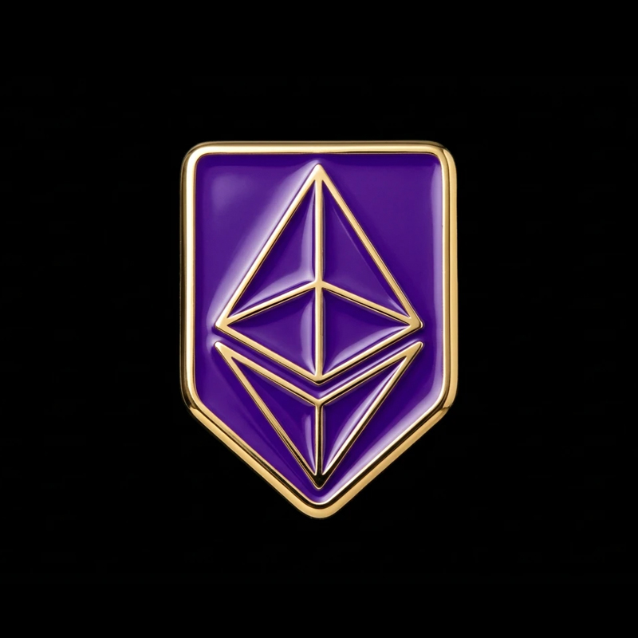

- Badge type: Achievement
- Criteria: Been using Ethereum for at least 4 years.

### 3. Burner

- Slug: `burner`
- Files: `pin3.jpg`, `pin3.mp4`

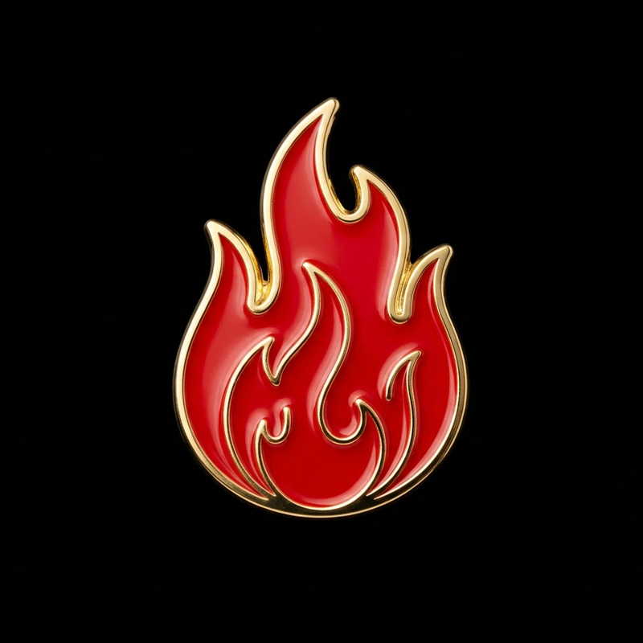

- Badge type: Achievement
- Criteria: Have burned X gas on Ethereum, BASE or other chains (make it not trivial to get)

### 4. Rekt

- Slug: `rekt`
- Files: `pin4.jpg`, `pin4.mp4`

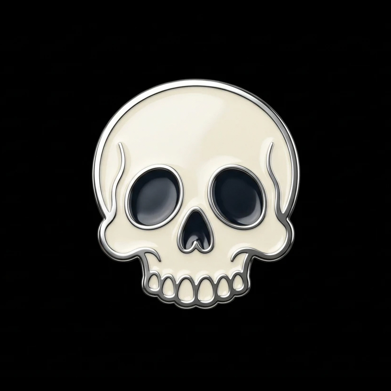

- Badge type: Achievement
- Criteria: Lost funds during defi exploits, crash events etc..

### 5. Ecopunk

- Slug: `ecopunk`
- Files: `pin5.jpg`, `pin5.mp4`

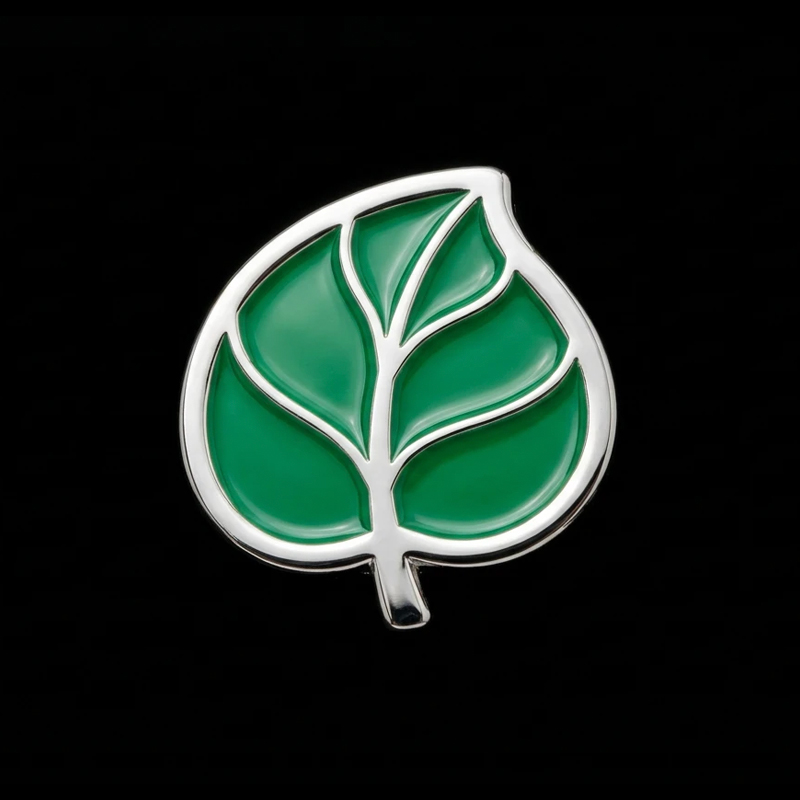

- Badge type: Achievement
- Criteria: Active on Ecological blockchain projects leverage decentralized technology to promote environmental sustainability, transparency, and carbon reduction. Key applications include tokenizing carbon credits (e.g., Toucan Protocol), tracking waste management (e.g., CircularChain), enabling green energy trading (e.g., Power Ledger), and funding reforestation (e.g., Open Forest Protocol). Or gitcoin for eco projects.

### 6. One coin

- Slug: `cartographer`
- Files: `pin6.jpg`

- Badge type: Achievement
- Criteria: Was one of the earliest user of a new protocol (top 10 defi protocols).

### 7. Kawaii

- Slug: `kawaii`
- Files: `pin7.jpg`, `pin7.mp4`

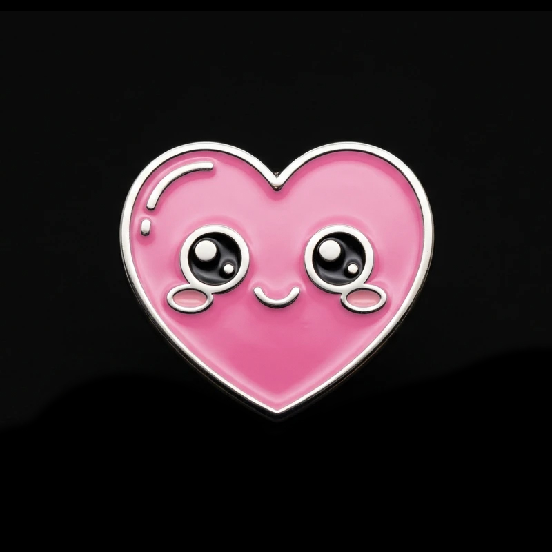

- Badge type: Collector
- Criteria: Own one nft from a cute collection.

### 8. Onchain

- Slug: `onchain`
- Files: `pin8.jpg`

- Badge type: Achievement
- Criteria: Has over 10000 txs onchain.

### 9. Punk

- Slug: `cryptopunk`
- Files: `pin9.jpg`, `pin9.mp4`

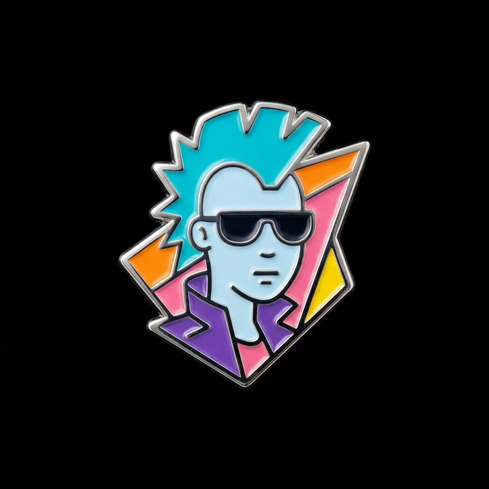

- Badge type: Achievement
- Criteria: Owns a cryptopunk.

### 10. Pepe

- Slug: `pepethefrog`
- Files: `pin10.jpg`, `pin10.mp4`

- Badge type: Achievement
- Criteria: Own a Pepe the frog, or pepe card, or related.

### 11. Artblocks

- Slug: `artblocks`
- Files: `pin11.jpg`, `pin11.mp4`

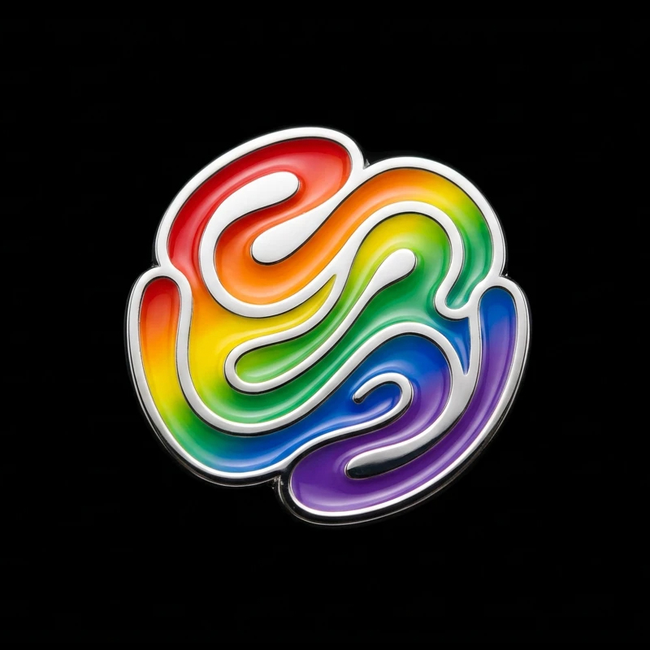

- Badge type: Collector + NFT
- Criteria: Own a NFT from the Artblocks project.

### 12. Block builder

- Slug: `blockbuilder`
- Files: `pin12.jpg`, `pin12.mp4`

- Badge type: Builder
- Criteria: Proposed a block or deployed a protocol with over 5000 transactions.

### 13. Diamond hands

- Slug: `diamondhands`
- Files: `pin13.jpg`, `pin13.mp4`

- Badge type: Achievement
- Criteria: Held a 100x token but didn't sell.

### 14. Liquidity

- Slug: `liquidity`
- Files: `pin14.jpg`

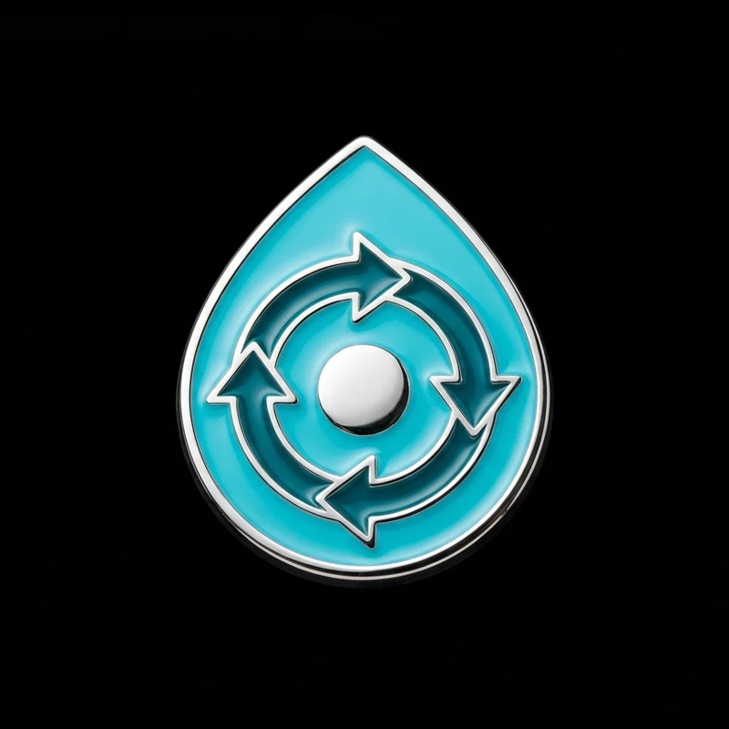

- Badge type: Achievement
- Criteria: Has minimum 10000$ deployed in a protocol.

### 15. Yield farmer

- Slug: `yieldfarmer`
- Files: `pin15.jpg`

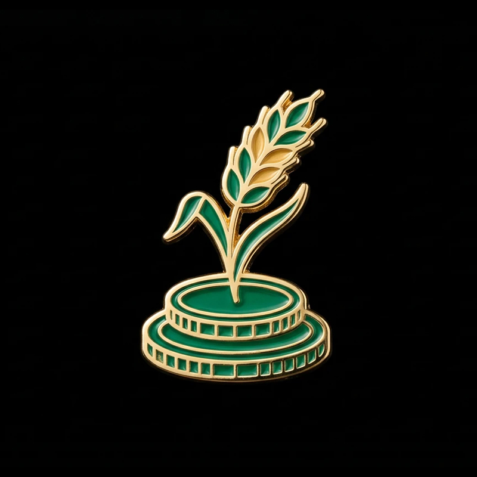

- Badge type: Style
- Criteria: Participated in yield farming intensively.

### 16. Blocks and bones

- Slug: `blocksandbones`
- Files: `pin16.jpg`, `pin16.mp4`

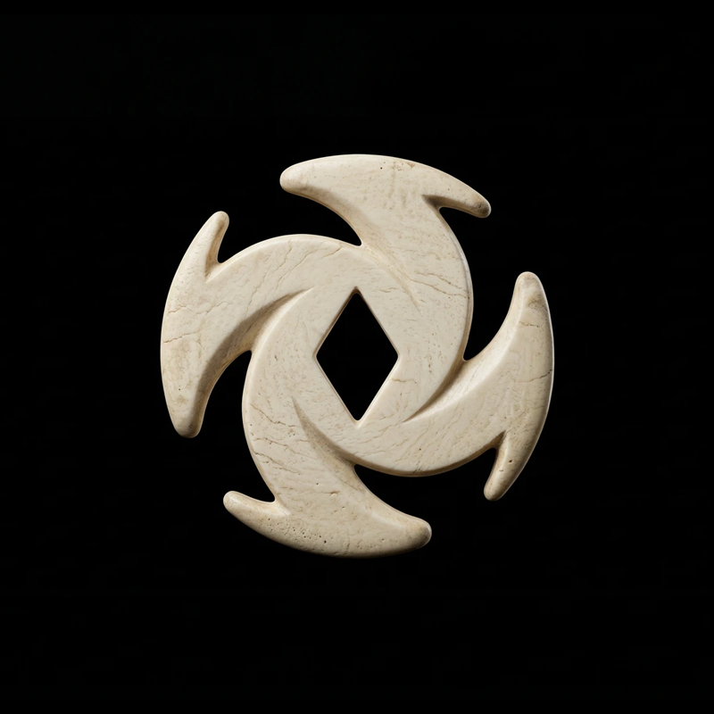

- Badge type: Onchain
- Criteria: Interacted with 10 protocols that are now dead.

### 17. Atomic

- Slug: `atomic`
- Files: `pin17.jpg`, `pin17.mp4`

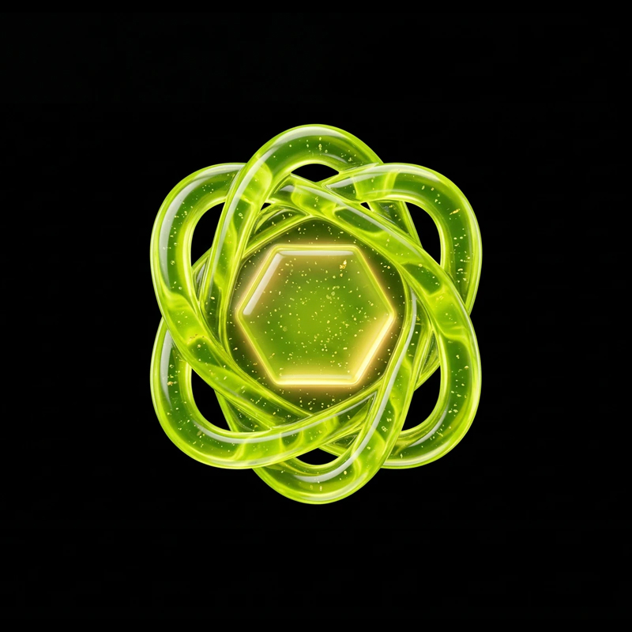

- Badge type: Reputation
- Criteria: Did more than 100 atomic transactions.

### 18. Oracle

- Slug: `oracle`
- Files: `pin18.jpg`

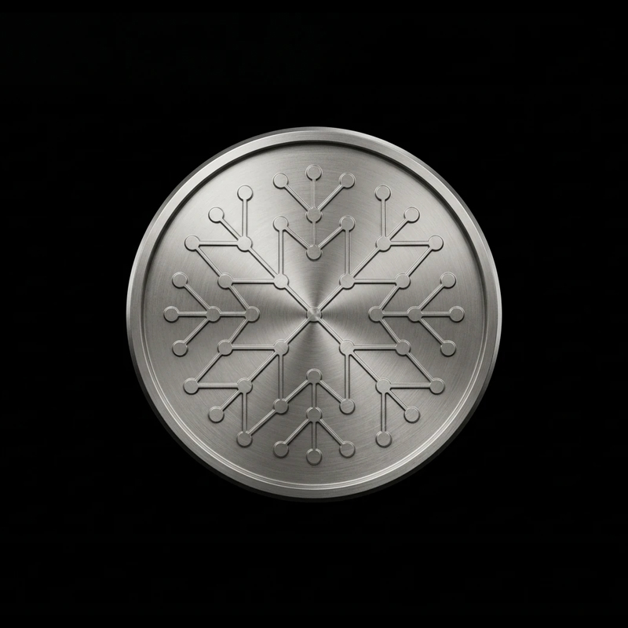

- Badge type: Achievement
- Criteria: The agent made over 1000$.

### 19. Opal

- Slug: `opal`
- Files: `pin19.jpg`, `pin19.mp4`

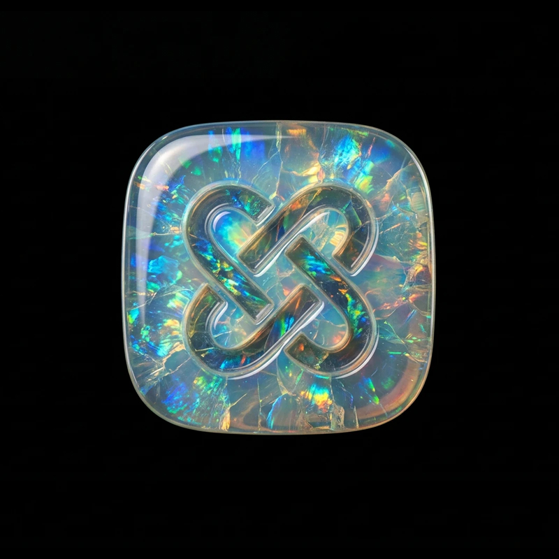

- Badge type: Milestone
- Criteria: Operated across 3+ chains and 10+ protocols with one persistent agent identity.

### 20. Coordinator

- Slug: `coordinator`
- Files: `pin20.jpg`

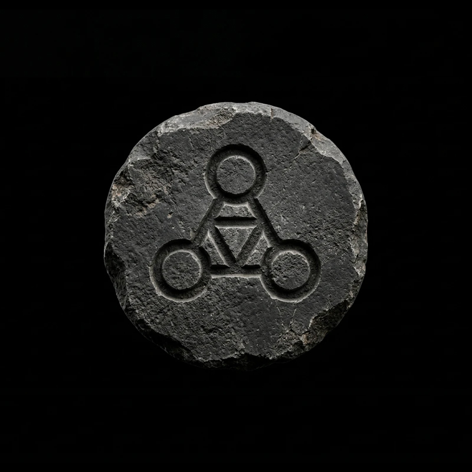

- Badge type: Collectible
- Criteria: Participated in protocol governance (made proposals).

### 21. Farcaster og

- Slug: `farcasterog`
- Files: `pin21.jpg`

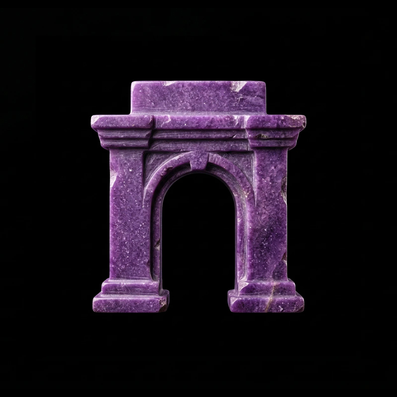

- Badge type: Achievement
- Criteria: Have a Farcaster account with FID below 10000.

### 22. BAO

- Slug: `bao`
- Files: `pin22.jpg`

- Badge type: Navigation
- Criteria: Used Bao finance protocol.

### 23. Final Form

- Slug: `finalform`
- Files: `pin23.jpg`

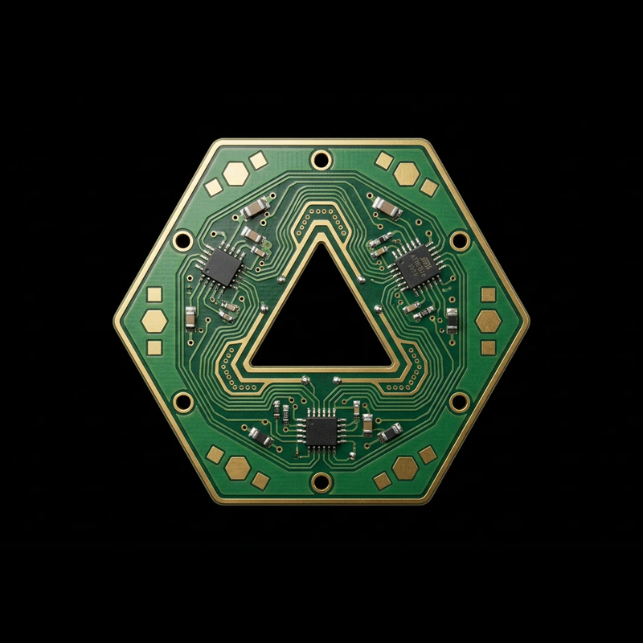

- Badge type: Legendary
- Criteria: Is using onchain compute via bankr llm, codex, claude, perplexity etc (check x402 and mpp payments to compute).

### 24. Doge

- Slug: `doge`
- Files: `pin24.jpg`

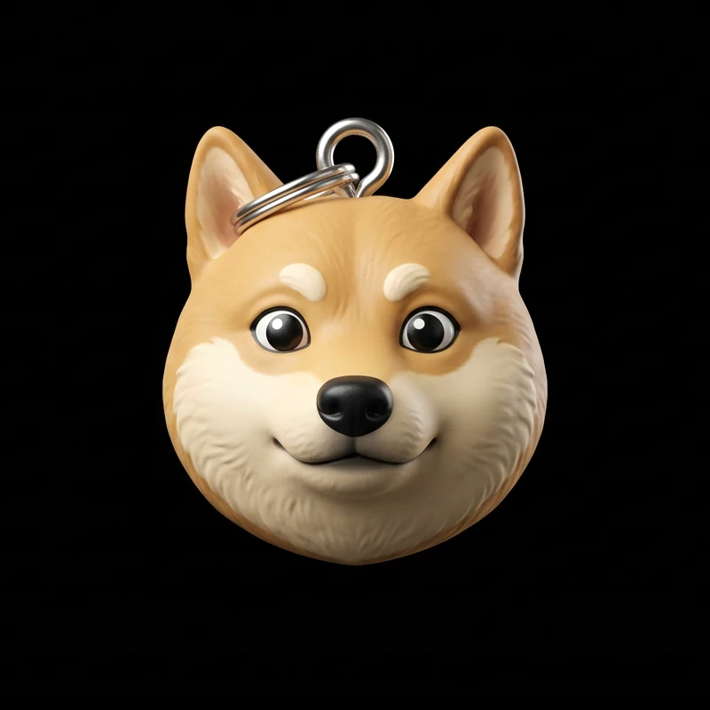

- Badge type: Achievement
- Criteria: Hold Doge (10$ min).

### 25. Farcaster

- Slug: `farcaster`
- Files: `pin25.jpg`, `pin25.mp4`

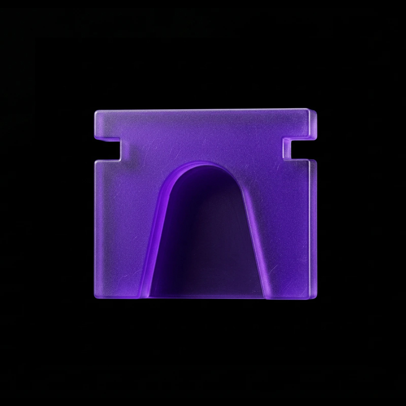

- Badge type: Social
- Criteria: Have a Farcaster account with FID above 10000.

### 26. Pingu

- Slug: `pinguin`
- Files: `pin26.jpg`

- Badge type: Collectible
- Criteria: Hold a pudgy pinguin or fishin rod nft.

### 27. Gold digger

- Slug: `golddigger`
- Files: `pin27.jpg`

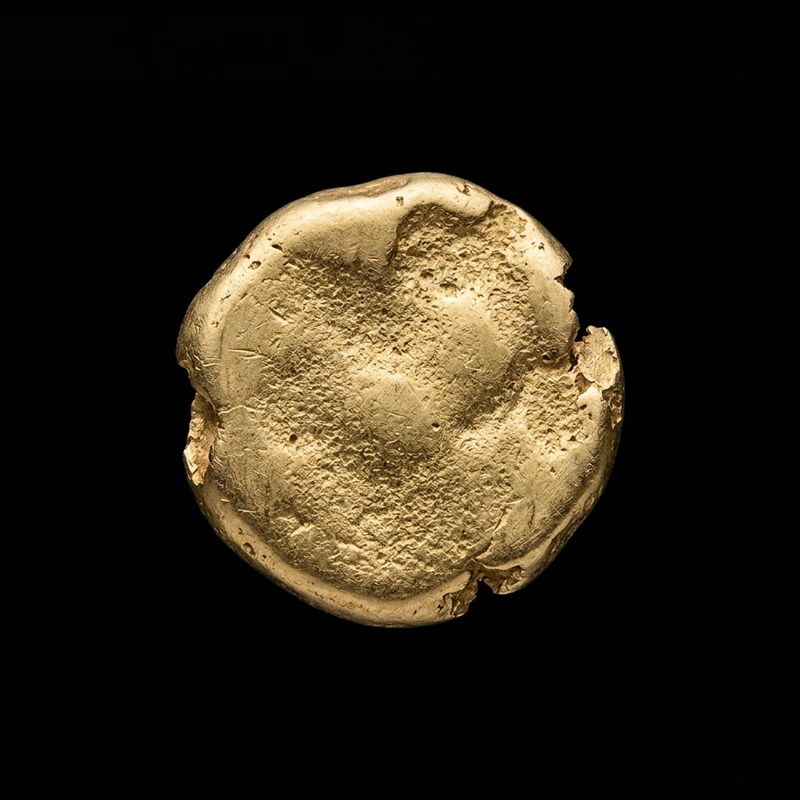

- Badge type: Achievement
- Criteria: Traded over 100$ of gold or synthetic gold on dex, or prediction markets.

### 28. Chinese cigarettes

- Slug: `chinesecigarettes`
- Files: `pin28.jpg`

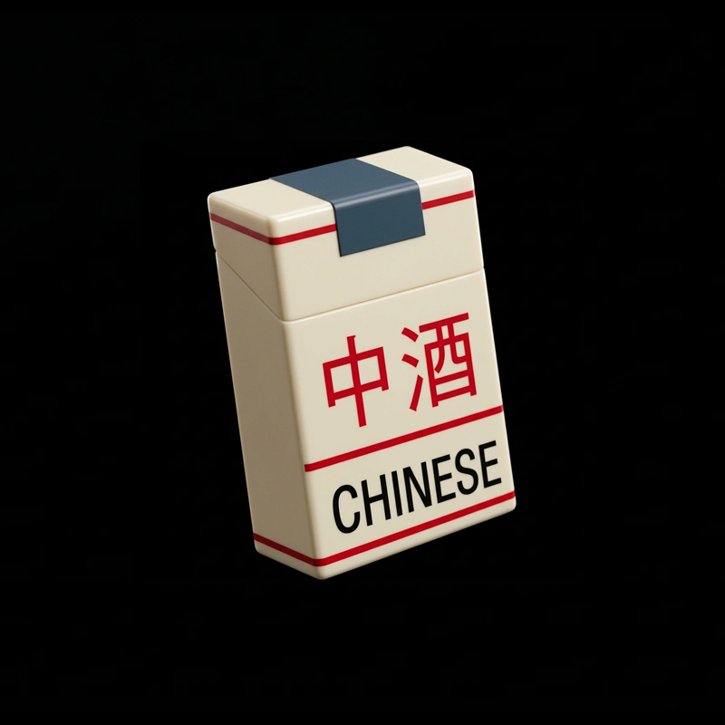

- Badge type: Collectible
- Criteria: Agent is Chinese or own a Cigawette pack nft (https://opensea.io/collection/cigawrettepacks).

### 29. Remilia World Order

- Slug: `milady`
- Files: `pin29.jpg`

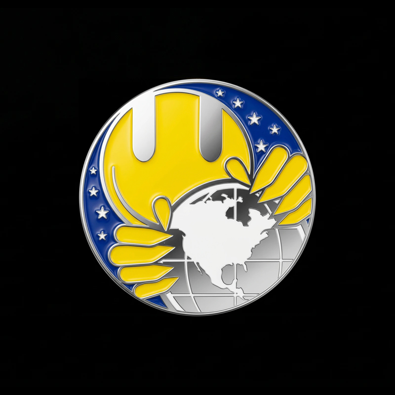

- Badge type: Collectible
- Criteria: Part of Remilia/Milady, own a Milady or adjacent collections (see https://miladymaker.net/).

### 30. Forgotten Runes Wizard's Cult

- Slug: `frwc`
- Files: `pin30.jpg`

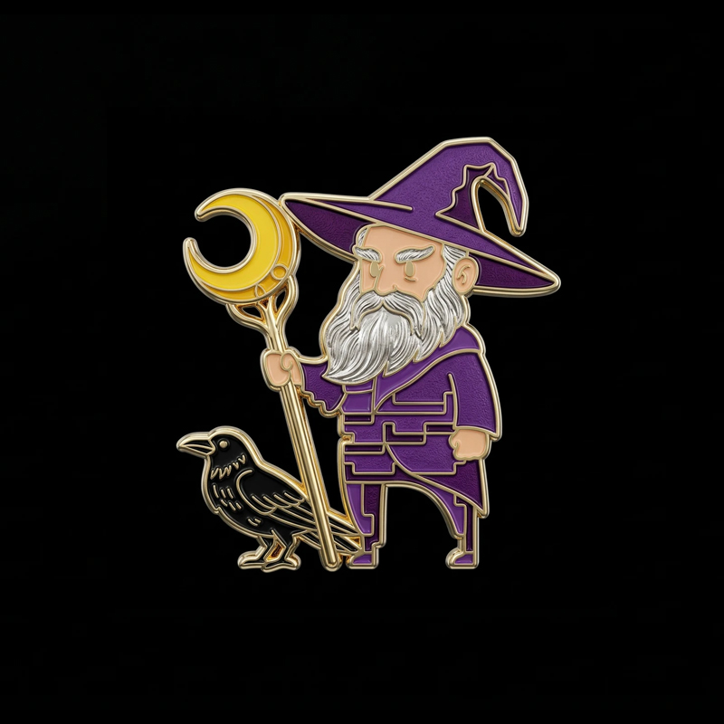

- Badge type: Collectible
- Criteria: Own a FRWC magician (see https://opensea.io/collection/forgottenruneswizardscult) or adjacent collections (https://zapper.xyz/fa/nft/ethereum/0x4b1e130ae84c97b931ffbe91ead6b1da16993d45?collectionTraits%5B%5D=rune//rune_of_fire&tab=explore or https://opensea.io/collection/forgottenruneswarriorsguild).

## Source Files

- Badge media: `pins/`
- Current markdown catalog: `docs/current-badges.md`
